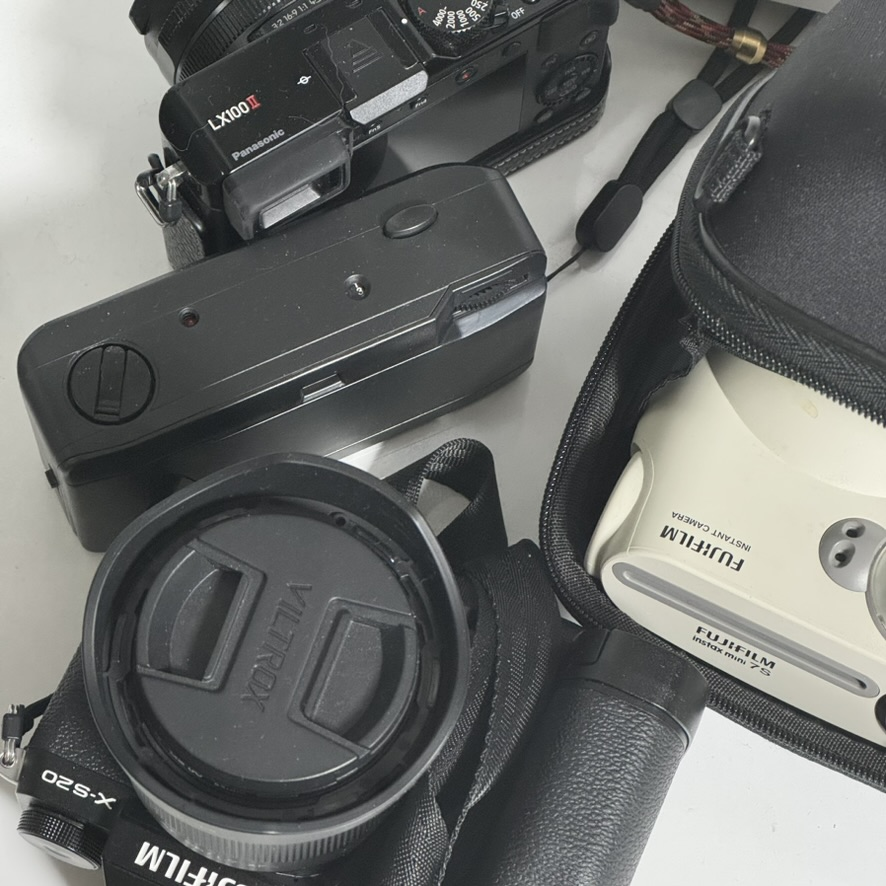

# Snap Scope

[English](./README.md) | 한국어

<p align="center">
  
  
</p>

### [Snap-Scope 사용해보기](https://snap-scope.shj.rip/?lng=ko)

## 이게 뭔가요?

Snap Scope는 사진 파일에서 EXIF 데이터를 추출해, 렌즈 초점거리(Focal length) 정보를 분석한 뒤, 이를 시각화해 주는 애플리케이션입니다. 사진 수천 장 이상을 한 번에 분석할 수 있어, 자주 사용하는 초점거리를 한눈에 파악할 수 있습니다.

- 여기서 사용하는 모든 초점거리는 35mm 포맷 기준으로 환산된 값입니다.

## 프라이버시

- 모든 이미지 처리와 EXIF 데이터 분석은 사용자의 브라우저에서만 이루어집니다.
- 이미지와 이미지에서 추출하는 모든 데이터는 브라우저 외부로 전송하지 않습니다.
- Google Analytics 등 어떤 방식으로도 사용자를 추적하지 않습니다.

## 시작하기

이 프로젝트는 [Node.js@22](https://nodejs.org/ko) 및 [PNPM@9.15.3](https://pnpm.io/ko/)을 이용합니다. PNPM은 [Node Corepack](https://nodejs.org/api/corepack.html)을 이용합니다. 자세한 설정은 [package.json](./package.json) 파일을 참고해 주세요.

```bash
# 1. 리포지토리 클론
git clone https://github.com/Gumball12/snap-scope.git
cd snap-scope

# 2. 디펜던시 설치
corepack enable # Corepack 활성화
pnpm install

# 3. 개발 서버 실행
pnpm dev # http://localhost:5173/

# 프로덕션 빌드
pnpm build
```

## 라이선스

[MIT License](./LICENSE)

## 왜 만들었나요?

<p align="center">
  
</p>

저는 취미로 사진을 찍습니다. 이 프로젝트는 사진을 찍으면서 느낀 필요로부터 시작되었습니다. 수천 장 사진을 찍다 보니 "내가 주로 어떤 초점거리로 세상을 바라보고 있을까?" 또는 "다음은 어떤 초점거리를 갖는 렌즈를 구매해야 할까?"와 같은 궁금증이 생겼고, 이를 쉽게 분석할 수 있는 도구를 찾게 되었습니다.

물론 기존에도 이런 도구들이 있습니다. 다만 대부분 데스크톱 애플리케이션이거나 사진을 서버에 업로드하는 방식을 이용했습니다. 개인적인 사진들을 서버에 올리는 것이 꺼려졌고, 누구나 쉽게 접근할 수 있는 웹 기반 도구가 있으면 좋겠다고 생각했습니다.

또한 AI 페어 프로그래밍을 실험해보는 좋은 기회이기도 했습니다. [Cursor AI IDE](https://www.cursor.com/)(Claude)를 활용한 개발 과정에서 AI가 어떻게 코드를 이해하고, 제안하고, 개선하는지 배울 수 있었습니다. 이 과정에서 얻은 인사이트는 앞으로의 개발 방식에도 많은 영향을 줄 것 같습니다. (관련 블로그 글도 있어요 -> [Cursor와 함께한 Vite 문서 번역 이야기](https://shj.rip/article/translate-to-korean-with-cursor.html))

이렇게 시작된 프로젝트가 다양한 사람들에게 흥미를 불러 일으키기를 바랍니다. 여러분의 촬영 패턴을 발견하는 재미있는 도구로 사용해주세요!
