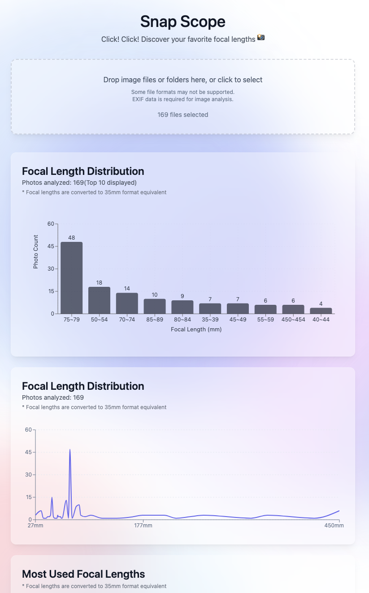
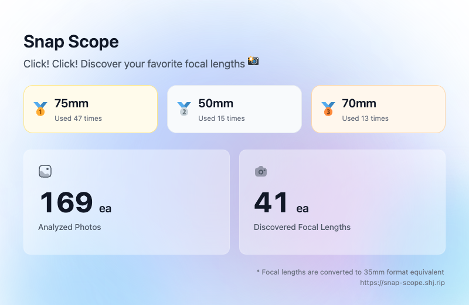
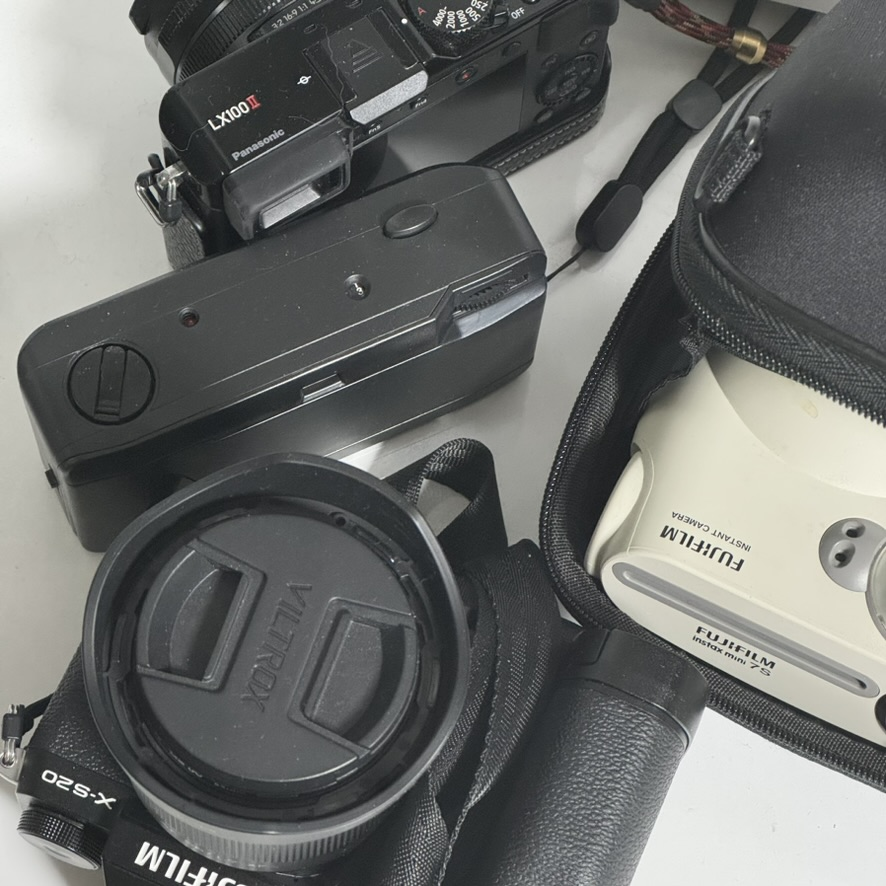

# Snap Scope

English | [한국어](./README.KO.md)

<p align="center">
  
  
</p>

### [✨ Try Snap-Scope Now!](https://snap-scope.shj.rip/?lng=en)

## What's This?

Snap Scope is an application that analyzes and visualizes lens focal length information by extracting EXIF data from your photos. It can process thousands of photos at once, allowing you to instantly understand your most frequently used focal lengths.

- All focal lengths are converted to 35mm format equivalent values.

## Privacy First 🔒

- Everything happens right in your browser - no servers involved
- Your photos and data stay with you - we don't send anything anywhere
- No tracking, no analytics - just you and your photography stats

## Getting Started

You'll need [Node.js@22](https://nodejs.org/) and [PNPM@9.15.3](https://pnpm.io/). We use [Node Corepack](https://nodejs.org/api/corepack.html) to manage PNPM. Check out [package.json](./package.json) for the full setup details.

```bash
# 1. Clone the repository
git clone https://github.com/Gumball12/snap-scope.git
cd snap-scope

# 2. Install dependencies
corepack enable # Enable Corepack
pnpm install

# 3. Start development server
pnpm dev # http://localhost:5173/

# Production build
pnpm build
```

## License

[MIT License](./LICENSE)

## Why I Built This

<p align="center">
  
</p>

I'm a photography enthusiast, and this project started with a simple question. After taking thousands of photos, I kept wondering: "What's my go-to focal length?" and "Which lens should I add to my collection next?" I needed a simple way to figure this out.

Sure, there were other tools out there, but they were either desktop apps or required uploading photos to some server. I wasn't too keen on uploading my personal photos, and I thought - why not make something that anyone can use right in their browser?

This project turned out to be more than just a photography tool - it became my playground for AI pair programming! I teamed up with [Cursor AI IDE](https://www.cursor.com/)(Claude Sonnet) to build this, and it was fascinating to see how AI could help with coding.

I hope you'll find Snap Scope as useful as I do. Give it a try and discover something new about your photography style! 📸✨
